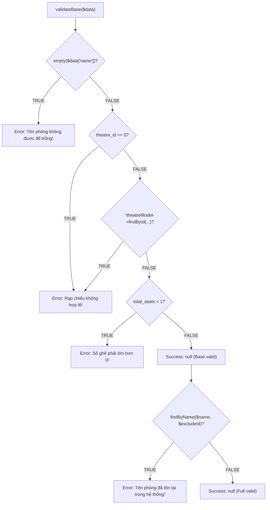

# 04 - White-box Decision Matrix & Coverage Analysis: Room Module
## KAN-57
## 1. Source Code Inspection & Decision Identification
Target File: [RoomService.php](file:///d:/xampp/htdocs/movie-ticket-booking/backend/app/Services/RoomService.php)

### Flowchart Decision Logic

---

## 2. White-box Decision Matrix Table

| Decision ID | Source Code Condition | TRUE Branch Outcome | FALSE Branch Outcome | TC Covering TRUE | TC Covering FALSE | Covered Status |
| :--- | :--- | :--- | :--- | :--- | :--- | :--- |
| **D1** | `empty($data['name'])` | Error: `"Tên phòng không được để trống!"` | Chuyển sang D2 | `testAddRoomFailsWhenNameEmpty` | `TC-ROOM-BVA-01` .. `05` | **COVERED** |
| **D2a** | `($data['theatre_id'] ?? 0) <= 0` | Error: `"Rạp chiếu không hợp lệ!"` | Chuyển sang D2b | `testAddRoomFailsWhenTheatreInvalid` | `TC-ROOM-BVA-01` .. `05` | **COVERED** |
| **D2b** | `!$this->theatreModel->findById(...)` | Error: `"Rạp chiếu không hợp lệ!"` | Chuyển sang D3 | `testAddRoomFailsWhenTheatreInvalid` | `TC-ROOM-BVA-01` .. `05` | **COVERED** |
| **D3** | `($data['total_seats'] ?? 0) < 1` | Error: `"Số ghế phải lớn hơn 0!"` | Trả về `null` (Thành công) | `TC-ROOM-BVA-01`, `TC-ROOM-BVA-02` | `TC-ROOM-BVA-03`, `TC-ROOM-BVA-04` | **COVERED** |
| **D4** | `$this->model->findByName(...)` | Error: `"Tên phòng đã tồn tại..."` | Trả về `null` (Thành công) | `testAddRoomFailsWhenNameAlreadyExists` | `TC-ROOM-BVA-05` | **COVERED** |
| **D5** | `$id <= 0` (trong `update`/`delete`) | Error: `"ID phòng không hợp lệ!"` | Tiếp tục xử lý ID | `testUpdateRoomFailsWithInvalidId`, `testDeleteRoomFailsWithInvalidId` | `testUpdateRoomSucceedsAndPersistsChanges` | **COVERED** |
| **D6** | `!$this->model->findById($id)` | Error: `"Phòng chiếu không tồn tại!"` | Tiến hành Cập nhật / Xóa | `testUpdateRoomFailsWhenRoomDoesNotExist`, `testDeleteRoomFailsWhenRoomDoesNotExist` | `testUpdateRoomSucceedsAndPersistsChanges`, `testDeleteRoomSucceeds` | **COVERED** |

---

## 3. Manual Decision Coverage Calculation

$$\text{Manual Decision Coverage} = \frac{\text{Covered Decision Outcomes}}{\text{Total Decision Outcomes}} \times 100\%$$

- **Tổng số Decision Outcomes**: $14$ (7 quyết định $\times$ 2 nhánh TRUE/FALSE).
- **Số Outcome đã được bao phủ**: $14 / 14$.
- **Manual Decision Coverage**: $\frac{14}{14} \times 100\% = \mathbf{100\%}$.

---

## 4. Tool-based Code Coverage Integration
- **PHPUnit + Xdebug / PCOV**: Chạy lệnh `d:\xampp\php\php.exe vendor/bin/phpunit --coverage-text` tạo báo cáo line coverage và branch coverage trực tiếp từ engine PHP.
- **SonarCloud**: Đẩy kết quả `coverage.xml` lên SonarCloud để đo đạc Code Coverage và Quality Gate độc lập.
