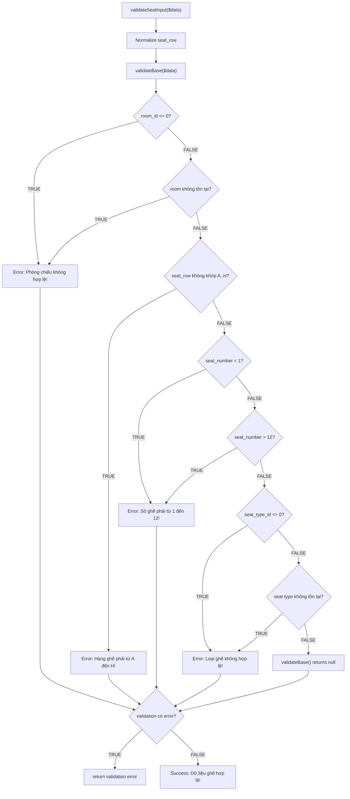

> **Phạm vi lịch sử (trước bản Assignment 75 case):** Nội dung và số liệu bên dưới mô tả bộ Seat cũ. Bản hiện hành gồm 18 validation + 25 generate + 32 bulkDelete, đã chạy PHPUnit 75/75, 307 assertions. Postman hiện có 18 validation case, chưa chạy lại; Xdebug bên dưới là evidence cũ. Xem [báo cáo hiện hành](083205006374_LuongQuocAn_BaoCao_Seat_Form_Assignment_Chot.md) và [mapping hiện hành](07_phpunit_mapping.md).

# 06 - White-box Decision Matrix & Coverage Analysis: Seat Module

## 1. Mục tiêu

Phân tích white-box cho phạm vi kiểm thử Seat đã chọn:

```text
Module   : Seat
Function : validateSeatInput($data)
Internal : validateBase($data)
Input BVA: seat_number
API      : POST /seats/validate
```

Phần này bám theo cách trình bày của `docs/testing/modules/room/whitebox.md` và sử dụng các test case BVA/validation hiện có của Seat để map vào từng decision trong source.

---

## 2. Source Code Inspection & Decision Identification

Target file:

```text
backend/app/Services/SeatService.php
```

Luồng được phân tích:

```text
validateSeatInput($data)
    ↓
normalize seat_row
    ↓
validateBase($data)
    ↓
if ($validation)
    ├── TRUE  → return error
    └── FALSE → return success
```

Trong `validateBase($data)`, các điều kiện chính là:

```php
if (($data['room_id'] ?? 0) <= 0 || !$this->roomModel->findById($data['room_id'])) {
    return ['status' => 'error', 'message' => 'Phòng chiếu không hợp lệ!'];
}

if (!preg_match('/^[A-H]$/', $data['seat_row'] ?? '')) {
    return ['status' => 'error', 'message' => 'Hàng ghế phải từ A đến H!'];
}

$seatNumber = (int)($data['seat_number'] ?? 0);

if ($seatNumber < 1 || $seatNumber > 12) {
    return ['status' => 'error', 'message' => 'Số ghế phải từ 1 đến 12!'];
}

if (($data['seat_type_id'] ?? 0) <= 0 || !$this->seatTypeModel->findById($data['seat_type_id'])) {
    return ['status' => 'error', 'message' => 'Loại ghế không hợp lệ!'];
}

return null;
```

### Quy tắc tách decision

Các biểu thức dùng `||` được tách thành các atomic decision để thể hiện rõ short-circuit path, giống cách Room tách `theatre_id <= 0` và `!findById(...)`.

Do đó Seat có các decision:

```text
D1a: room_id <= 0
D1b: room không tồn tại
D2 : seat_row không khớp A..H
D3a: seat_number < 1
D3b: seat_number > 12
D4a: seat_type_id <= 0
D4b: seat type không tồn tại
D5 : validateBase() trả về validation error?
```

---

## 3. Flowchart Decision Logic



---

## 4. White-box Decision Matrix

| Decision ID | Source Code Condition | TRUE Branch Outcome | FALSE Branch Outcome | TC/Test Covering TRUE | TC/Test Covering FALSE | Covered Status |
|---|---|---|---|---|---|---|
| **D1a** | `($data['room_id'] ?? 0) <= 0` | Error: `Phòng chiếu không hợp lệ!` | Tiếp tục kiểm tra room tồn tại | `testValidateSeatRejectsInvalidRoom` (`room_id=0`) | Các BVA hợp lệ với `room_id=1` | **COVERED** |
| **D1b** | `!$this->roomModel->findById($data['room_id'])` | Error: `Phòng chiếu không hợp lệ!` | Chuyển sang D2 | `testValidateSeatRejectsNonExistingRoom` (`room_id=999999`) | Các BVA với room tồn tại | **COVERED** |
| **D2** | `!preg_match('/^[A-H]$/', seat_row)` | Error: `Hàng ghế phải từ A đến H!` | Chuyển sang D3a | `testValidateSeatRejectsInvalidRow` (`seat_row=I`) | Các BVA với `seat_row=A` | **COVERED** |
| **D3a** | `$seatNumber < 1` | Error: `Số ghế phải từ 1 đến 12!` | Tiếp tục D3b | `TC-SEAT-BVA-01` (`seat_number=0`) | `TC-SEAT-BVA-02`, `03`, `07`, `04`, `05`, `06` | **COVERED** |
| **D3b** | `$seatNumber > 12` | Error: `Số ghế phải từ 1 đến 12!` | Chuyển sang D4a | `TC-SEAT-BVA-06` (`seat_number=13`) | `TC-SEAT-BVA-02`, `03`, `07`, `04`, `05` | **COVERED** |
| **D4a** | `($data['seat_type_id'] ?? 0) <= 0` | Error: `Loại ghế không hợp lệ!` | Tiếp tục kiểm tra seat type tồn tại | `testValidateSeatRejectsInvalidSeatType` (`seat_type_id=0`) | Các BVA với `seat_type_id=1` | **COVERED** |
| **D4b** | `!$this->seatTypeModel->findById($data['seat_type_id'])` | Error: `Loại ghế không hợp lệ!` | `validateBase()` trả `null` | `testValidateSeatRejectsNonExistingSeatType` (`seat_type_id=999999`) | Các BVA với seat type tồn tại | **COVERED** |
| **D5** | `if ($validation)` trong `validateSeatInput()` | Return validation error | Return `status=success` | BVA `0`, `13` và các invalid validation tests | BVA `1`, `2`, `6`, `11`, `12` | **COVERED** |

---

## 5. Mapping BVA Test Cases vào White-box Decision

### 5.1 BVA Test Cases

| TC ID | seat_number | Boundary | Expected | White-box Path chính |
|---|---:|---|---|---|
| `TC-SEAT-BVA-01` | 0 | MIN - 1 | error | D1a=F → D1b=F → D2=F → **D3a=T** → D5=T |
| `TC-SEAT-BVA-02` | 1 | MIN | success | D1a=F → D1b=F → D2=F → D3a=F → D3b=F → D4a=F → D4b=F → D5=F |
| `TC-SEAT-BVA-03` | 2 | MIN + 1 | success | D1a=F → D1b=F → D2=F → D3a=F → D3b=F → D4a=F → D4b=F → D5=F |
| `TC-SEAT-BVA-07` | 6 | NOMINAL | success | D1a=F → D1b=F → D2=F → D3a=F → D3b=F → D4a=F → D4b=F → D5=F |
| `TC-SEAT-BVA-04` | 11 | MAX - 1 | success | D1a=F → D1b=F → D2=F → D3a=F → D3b=F → D4a=F → D4b=F → D5=F |
| `TC-SEAT-BVA-05` | 12 | MAX | success | D1a=F → D1b=F → D2=F → D3a=F → D3b=F → D4a=F → D4b=F → D5=F |
| `TC-SEAT-BVA-06` | 13 | MAX + 1 | error | D1a=F → D1b=F → D2=F → D3a=F → **D3b=T** → D5=T |

### 5.2 Supporting Validation / White-box Tests

| PHPUnit Test | Input đặc biệt | Decision TRUE được cover | Expected |
|---|---|---|---|
| `testValidateSeatRejectsInvalidRoom` | `room_id=0` | D1a | error |
| `testValidateSeatRejectsNonExistingRoom` | `room_id=999999` | D1b | error |
| `testValidateSeatRejectsInvalidRow` | `seat_row=I` | D2 | error |
| `testValidateSeatRejectsInvalidSeatType` | `seat_type_id=0` | D4a | error |
| `testValidateSeatRejectsNonExistingSeatType` | `seat_type_id=999999` | D4b | error |

---

## 6. Manual Decision Coverage Calculation

Cách tính:

```text
Manual Decision Coverage
= Covered Decision Outcomes / Total Decision Outcomes × 100%
```

Có:

```text
8 decisions
Mỗi decision có TRUE + FALSE
→ Total decision outcomes = 8 × 2 = 16
```

Các test hiện tại cover:

```text
D1a: TRUE + FALSE
D1b: TRUE + FALSE
D2 : TRUE + FALSE
D3a: TRUE + FALSE
D3b: TRUE + FALSE
D4a: TRUE + FALSE
D4b: TRUE + FALSE
D5 : TRUE + FALSE
```

Suy ra:

```text
Covered Decision Outcomes = 16
Total Decision Outcomes   = 16

Manual Decision Coverage
= 16 / 16 × 100%
= 100%
```

> Lưu ý: đây là **manual decision coverage dựa trên source và test mapping**. Không được gọi con số này là PHPUnit line coverage, branch coverage của Xdebug/PCOV hoặc SonarCloud coverage.

---

## 7. Condition Coverage cho các biểu thức OR

Ba biểu thức compound quan trọng:

```text
room_id <= 0 OR room không tồn tại
seat_number < 1 OR seat_number > 12
seat_type_id <= 0 OR seat type không tồn tại
```

### Room condition

| Atomic condition | TRUE case | FALSE case |
|---|---|---|
| `room_id <= 0` | `room_id=0` | `room_id=1`, `999999` |
| room không tồn tại | `room_id=999999` | `room_id=1` |

### Seat number condition

| Atomic condition | TRUE case | FALSE case |
|---|---|---|
| `seat_number < 1` | `0` | `1,2,6,11,12,13` |
| `seat_number > 12` | `13` | `1,2,6,11,12` |

### Seat type condition

| Atomic condition | TRUE case | FALSE case |
|---|---|---|
| `seat_type_id <= 0` | `0` | `1`, `999999` |
| seat type không tồn tại | `999999` | `1` |

Nhờ hai test positive-but-not-found (`999999`), nhánh thứ hai của các biểu thức OR về room và seat type cũng được exercise.

---

## 8. Phân biệt White-box với BVA

BVA trả lời câu hỏi:

```text
Các giá trị biên nào của seat_number cần test?
```

White-box trả lời câu hỏi:

```text
Các decision/branch nào trong source đã được exercise bởi các test?
```

Ví dụ:

```text
seat_number = 0
```

vừa là:

```text
Robustness BVA: MIN - 1
```

vừa exercise:

```text
D3a = TRUE
D5  = TRUE
```

Trong khi:

```text
room_id = 999999
```

không phải BVA của seat_number, mà là supporting white-box test để exercise:

```text
D1a = FALSE
D1b = TRUE
```

---

## 9. Tool-based Code Coverage

Manual decision coverage ở trên không thay thế tool-based coverage.

Khi Xdebug hoặc PCOV được bật, chạy:

```powershell
cd C:\xampp\htdocs\movie-ticket-booking\backend

$env:XDEBUG_MODE="coverage"

C:\xampp\php\php.exe vendor\bin\phpunit tests\Services\SeatServiceTest.php --coverage-text
```

Nếu muốn tạo Clover:

```powershell
C:\xampp\php\php.exe vendor\bin\phpunit tests\Services\SeatServiceTest.php `
  --coverage-clover coverage-seat.xml
```

Các số liệu tool-based phải lấy từ output thực tế. Không suy ra PHPUnit/Sonar coverage từ manual decision matrix.

---

## 10. Kết luận

White-box cho phạm vi `validateSeatInput()` / `validateBase()` của Seat có:

```text
8 decisions
16 decision outcomes
16 outcomes được map với test hiện có
Manual Decision Coverage = 100%
```

Các test `room_id=999999` và `seat_type_id=999999` có vai trò quan trọng vì chúng exercise nhánh thứ hai trong hai biểu thức short-circuit `||`.

Phần này chỉ kết luận về **manual white-box decision coverage**. Tool-based code coverage phải được báo cáo riêng bằng PHPUnit + Xdebug/PCOV và/hoặc SonarCloud.
